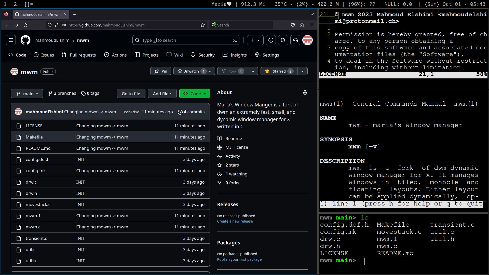

mwm - Maria's Window Manager
=====================================
mwm is a fork of [dwm](https://dwm.suckless.org/) an extremely fast, small, and dynamic window manager for X written in C.




Requirements
------------
In order to build mwm you need the Xlib header files.


Installation
------------
Edit config.mk to match your local setup (mwm is installed into
the /usr/local namespace by default).

Afterwards enter the following command to build and install mwm (if
necessary as root):
```
make clean install
```

Running mwm
------------
Add the following line to your .xinitrc to start mwm using startx:
```
exec mwm
```
In order to connect mwm to a specific display, make sure that
the DISPLAY environment variable is set correctly, e.g.:
```
DISPLAY=foo.bar:1 exec mwm
```
(This will start mwm on display :1 of the host foo.bar.)

In order to display status info in the bar, you can do something
like this in your .xinitrc:
```
    while xsetroot -name "`date` `uptime | sed 's/.*,//'`"
    do
    	sleep 1
    done &
    exec mwm
```
Or you can use something better like [slstatus](https://tools.suckless.org/slstatus/) which is written in C.
```
    slstatus&
    exec mwm
```

Configuration
-------------
The configuration of mwm is done by creating a custom config.h and (re)compiling the source code.
