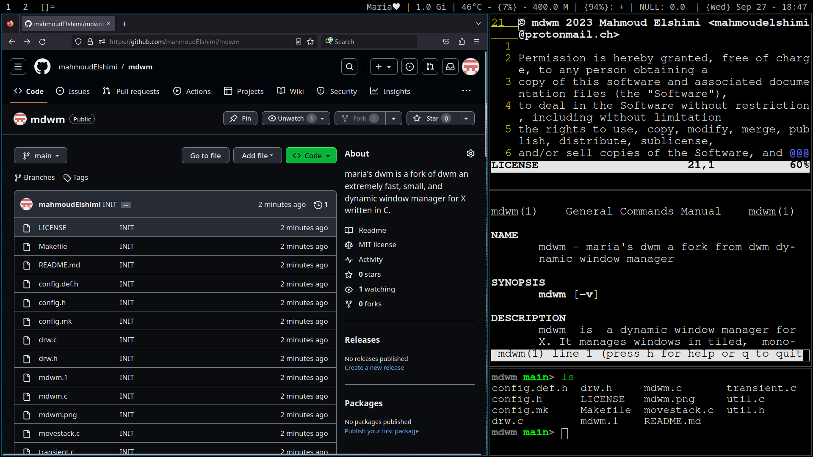

mdwm - maria's dynamic window manager
=====================================
mdwm is a fork of [dwm](https://dwm.suckless.org/) an extremely fast, small, and dynamic window manager for X written in C.




Requirements
------------
In order to build mdwm you need the Xlib header files.


Installation
------------
Edit config.mk to match your local setup (mdwm is installed into
the /usr/local namespace by default).

Afterwards enter the following command to build and install mdwm (if
necessary as root):
```
$ make clean install
```

Running mdwm
------------
Add the following line to your .xinitrc to start mdwm using startx:
```
exec mdwm
```
In order to connect mdwm to a specific display, make sure that
the DISPLAY environment variable is set correctly, e.g.:
```
DISPLAY=foo.bar:1 exec mdwm
```
(This will start mdwm on display :1 of the host foo.bar.)

In order to display status info in the bar, you can do something
like this in your .xinitrc:
```
    while xsetroot -name "`date` `uptime | sed 's/.*,//'`"
    do
    	sleep 1
    done &
    exec mdwm
```

Configuration
-------------
The configuration of mdwm is done by creating a custom config.h and (re)compiling the source code.
